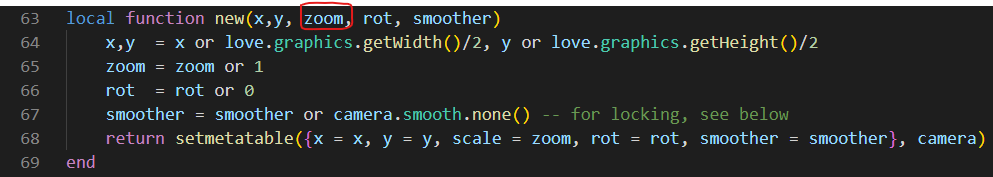
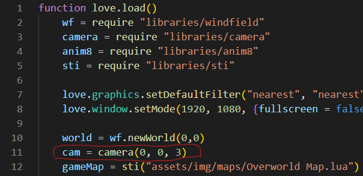
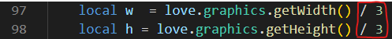
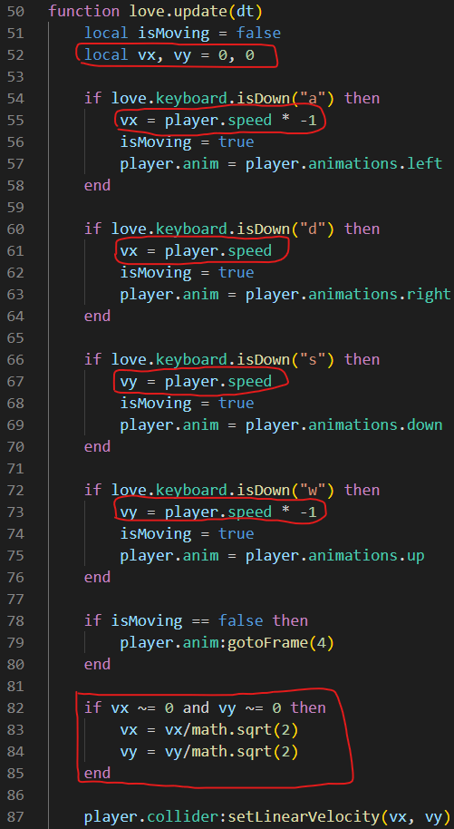
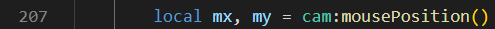
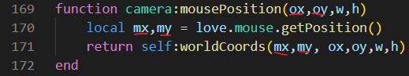
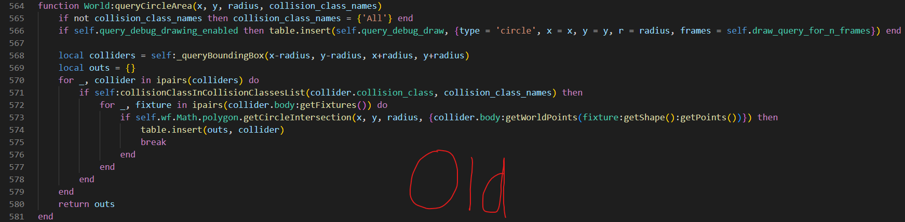
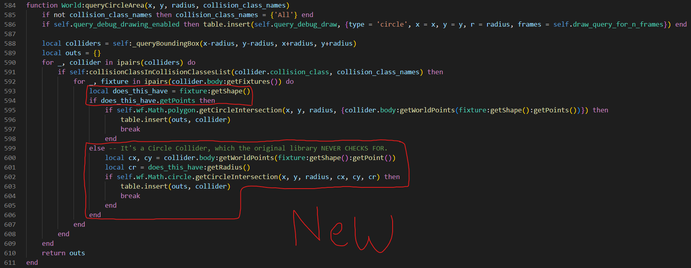

# Fixes

> **Player couldn't walk past a certain point because the map was scaled up/zoomed in**  
>> The fix was to set a zoom value when creating the camera and then dividing the width and height of the background by that zoom value (which was 3 in this case)  
  
  
  

---

> **When moving diagonally, player would move slightly faster than intended**  
>> The fix was to divide by the square root of the verticle and horizontal movement when moving diagonally  
  

---

> **When getting the player's mouse position, the value returned is the position of the mouse on screen, and the player's position is in the world. I need both values based in the world so i can compare them and calculate distances/angles etc**  
>> I fixed this by getting the mouse position from the camera  
  

---

> **Queries didn't work on circles in the windfield library**  
>> Replaced the old function in the windfield library with a fixed one  
  
  

---

